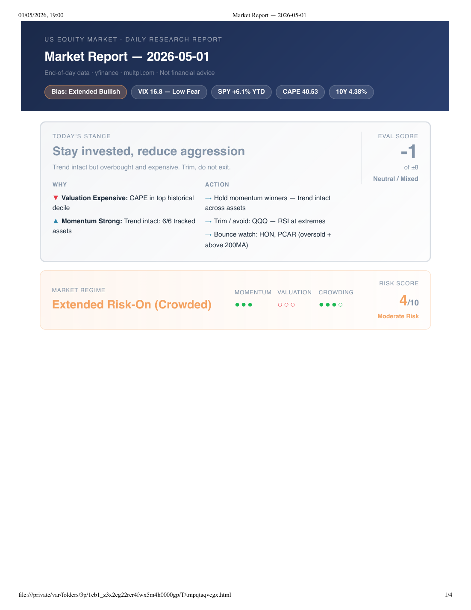

# Market Report Agent

A daily US equity market report system. Run three scripts after market close, get a professional decision-grade PDF.



---

## What it produces

A single PDF covering:

- **Executive Stance** — synthesised position in one line (e.g. "Stay invested, reduce aggression")
- **Evaluation Score** — four-factor model (Momentum / Valuation / Crowding / Macro), rated −8 to +8
- **Market State** — index technicals + internal breadth (% above 50MA / 200MA / % advancing)
- **Vol Structure** — VIX term structure proxy (contango / backwardation) + VVIX
- **Key Signals** — DXY direction, credit spread (HY vs IG), commodity macro
- **Action Lists** — AQR momentum watchlist / Avoid-overbought / RSI-2 bounce watch
- **YTD Snapshot** — top momentum / overcrowded / losing momentum pills
- **Strategy Evaluation** — factor table with evidence + interpretation + forward probability scenarios
- **Sector Flow** — strict strong/weak grid with 5D scores + cyclical/defensive/growth rotation signal
- **Valuation** — PE, CAPE, earnings yield, 10Y yield, Fed Model spread
- **Top 3 Catalysts** — news ranked by impact

---

## Daily workflow

```bash
# 1. Run after market close (4pm ET / 9pm UK)
python3 scripts/collect_market_data.py    # ~103 tickers, 1-year OHLCV
python3 scripts/calculate_indicators.py  # returns, MAs, RSI, sector scores
python3 scripts/collect_news.py           # RSS + yfinance news

# collect_valuation.py runs automatically but only fetches when >7 days old
python3 scripts/collect_valuation.py

# 2. Generate the PDF
python3 scripts/generate_pdf_report.py
# → reports/YYYY-MM-DD_daily_market_report.pdf
```

Or just open Claude Code and say: **"generate today's report"**

---

## Requirements

```bash
pip3 install yfinance pandas numpy requests beautifulsoup4 matplotlib lxml pymupdf
```

Requires **Google Chrome** (used for HTML → PDF via headless Chrome).

---

## Data coverage

| Group | Tickers |
|---|---|
| Indices | SPY, QQQ, DIA, IWM, ^VIX, ^TNX |
| Vol structure | ^VVIX, VXX, VXZ |
| Cross-asset | DX-Y.NYB (DXY), HYG, LQD |
| Sector ETFs | XLK, XLF, XLE, XLV, XLI, XLY, XLP, XLU, XLB, XLRE, XLC |
| Commodities | CL=F, BZ=F, GC=F, SI=F, HG=F, NG=F |
| Nasdaq 100 | ~80 tickers |

---

## Strategies implemented

| Strategy | Source | Signal used |
|---|---|---|
| Dual Momentum | Antonacci (2014) | SPY YTD as absolute momentum proxy |
| Faber GTAA | Faber (2007) | Count of 6 assets above 200MA |
| AQR Cross-Sectional | Asness et al. (2012) | 12−1 month momentum score |
| RSI-2 Mean Reversion | Connors (2009) | RSI < 35 + above 200MA |

Strategy documentation: [`strategies/`](strategies/)

Evaluation framework: [`strategies/evaluation_framework.md`](strategies/evaluation_framework.md)

---

## Folder structure

```
market_report_agent/
├── scripts/
│   ├── collect_market_data.py    # downloads OHLCV via yfinance
│   ├── calculate_indicators.py  # computes returns, MAs, RSI, sector scores
│   ├── collect_valuation.py      # PE / CAPE from multpl.com (auto, weekly)
│   ├── collect_news.py           # RSS + yfinance news
│   └── generate_pdf_report.py   # builds HTML → PDF via Chrome headless
├── strategies/
│   ├── evaluation_framework.md  # factor scoring rules
│   ├── dual_momentum.md
│   ├── faber_gtaa.md
│   └── aqr_momentum.md
├── data/
│   └── processed/               # CSVs + JSON (gitignored, regenerated daily)
├── reports/                     # generated PDFs (gitignored)
└── docs/
    └── example_report.png       # sample output shown above
```

---

## Notes

- Reports are gitignored — only the example image is committed
- Data files are gitignored — regenerated fresh each day
- Scripts skip re-download if today's file already exists (safe to re-run)
- `collect_valuation.py` only fetches when snapshot is >7 days old
- All times relative to US Eastern market close (4pm ET)
